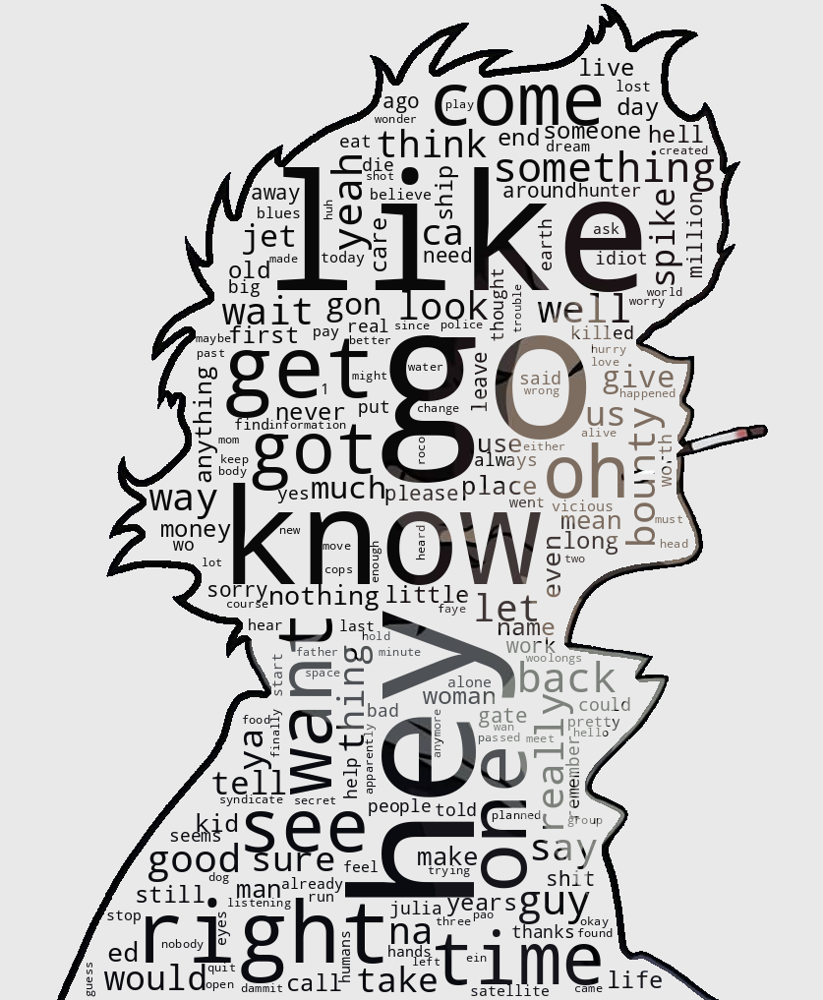
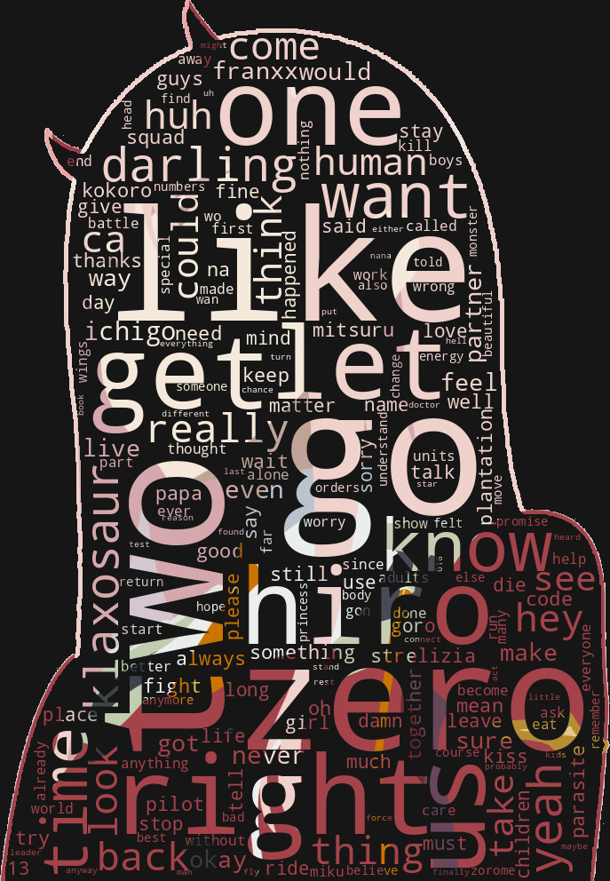
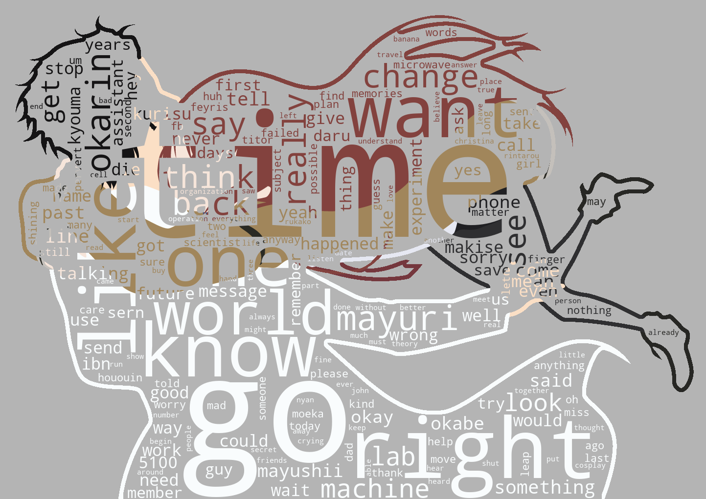

# Information

Feel free to create pull requests, but do not commit subtitles !

To create a visualization :

1.  Extracts the subtitles using [FFMPEG](https://www.ffmpeg.org/) to the VTT format, due to obvious copyright problems, they can't be on the repository.
2.  Preprocess the image using [a graphical tool](https://www.gimp.org/) to create a mask.
    -   Black: Word cloud space
    -   White: Kept as is from the image
    -   Grey value: Discarded from the visualization
3.  From this mask and the words obtained from the subtitles, the script uses [nltk](https://www.nltk.org/) to remove [stop words](https://pastebin.com/F0XyDqUR), [wordcloud](https://pypi.org/project/wordcloud/) to create a visualization and a bit of [numpy](https://numpy.org/) image math's.

# List

1.  [Cowboy Bebop](#cowboy-bebop)
2.  [Neon Genesis Evangelion](#neon-genesis-evangelion)
3.  [Darling in the Franxx](#darling-in-the-franxx)
4.  [Mirai Nikki](#mirai-nikki)
5.  [Death Note](#death-note)
6.  [Steins;Gate](#steinsgate)

## Cowboy Bebop

Data used:

-   English subtitles from : [Cowboy Bebop](https://en.wikipedia.org/wiki/Cowboy_Bebop) (1998)
-   [Original image](https://pinterest.com/pin/853572935621662671/)

Reddit posts: [r/dataisbeautiful](https://www.reddit.com/r/dataisbeautiful/comments/n8l6c3/) / [r/cowboybebop](https://www.reddit.com/r/cowboybebop/comments/n8l8v4/)

## Neon Genesis Evangelion

Data used:

-   English subtitles from : [Neon Genesis Evangelion](https://en.wikipedia.org/wiki/Neon_Genesis_Evangelion) (1995)
-   [Original image](https://7themes.su/photo/hd_wallpapers/anime/neon_genesis_evangelion_minimal/57-0-11947)

Reddit posts : [r/dataisbeautiful](https://www.reddit.com/r/dataisbeautiful/comments/l2ozn2/) [r/evangelion](https://www.reddit.com/r/evangelion/comments/l2p3k3/)

## Darling in the Franxx

Data used:

-   English subtitles from : [Darling in the Franxx](https://en.wikipedia.org/wiki/Darling_in_the_Franxx) (2018)
-   [Original image](https://wallpaperforu.com/anime-darling-in-the-franxx-minimalist-wallpaper/)

## Mirai Nikki

Data used:

-   English subtitles from : [Mirai Nikki](https://en.wikipedia.org/wiki/Future_Diary) (2011)
-   [Original image](https://www.deviantart.com/max028/art/Yuki-and-Yuno-Mirai-Nikki-Minimal-Wallpaper-2-682607077)

## Death Note

Data used:

-   English subtitles from : [Death Note](https://en.wikipedia.org/wiki/Death_Note) (2006)
-   [Original image](https://wallpapercave.com/w/wp8539142)

## Steins;Gate

Data used:

-   English subtitles from : [Steins;Gate](https://en.wikipedia.org/wiki/Steins;Gate) (2009)
-   [Original image](https://w.forfun.com/fetch/1b/1b43426a9670562371613517762b3fe8.jpeg)
