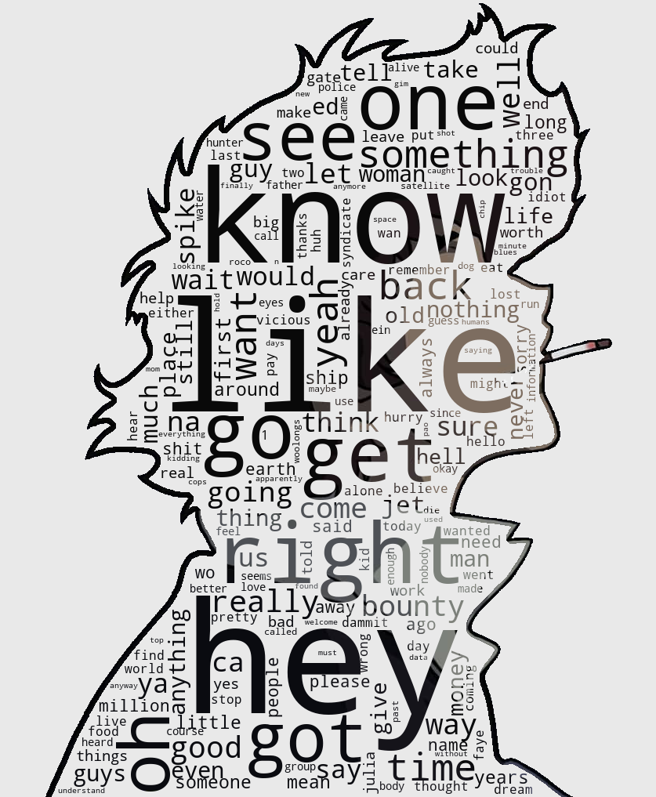
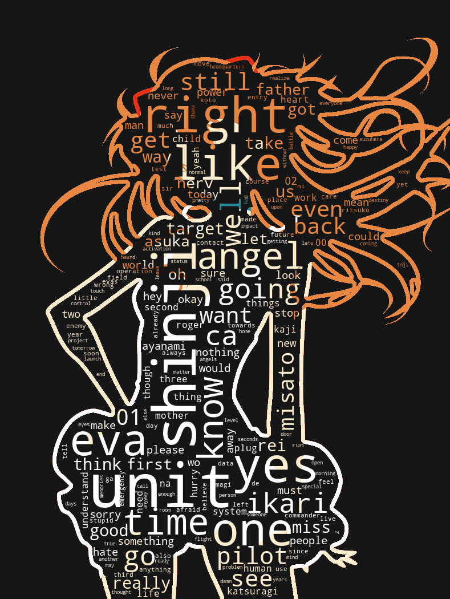

# Information

Feel free to create pull requests, but do not commit subtitles !

To create a visualization :

1.  Extracts the subtitles using [FFMPEG](https://www.ffmpeg.org/) to the VTT format, due to obvious copyright problems, they can't be on the repository.
2.  Preprocess the image using [a graphical tool](https://www.gimp.org/) to create a mask.
    -   Black: Word cloud space
    -   White: Kept as is from the image
    -   Grey value: Discarded from the visualization
3.  From this mask and the words obtained from the subtitles, the script uses [nltk](https://www.nltk.org/) to remove stop words, [wordcloud](https://pypi.org/project/wordcloud/) to create a visualization and a bit of [numpy](https://numpy.org/) image math's.

# Cowboy Bebop

Data used:

-   English subtitles from : [Cowboy Bebop](https://en.wikipedia.org/wiki/Cowboy_Bebop) (1998)
-   [Original image](https://wallup.net/cowboy-bebop-spike-spiegel-monochrome-anime-minimalism/)

# Neon Genesis Evangelion

Data used:

-   English subtitles from : [Neon Genesis Evangelion](https://en.wikipedia.org/wiki/Neon_Genesis_Evangelion) (1995)
-   [Original image](https://7themes.su/photo/hd_wallpapers/anime/neon_genesis_evangelion_minimal/57-0-11947)

Reddit posts : [r/dataisbeautiful](https://www.reddit.com/r/dataisbeautiful/comments/l2ozn2/oc_neon_genesis_evangelion_word_cloud/) [r/evangelion](https://www.reddit.com/r/evangelion/comments/l2p3k3/neon_genesis_evangelion_word_cloud/)
